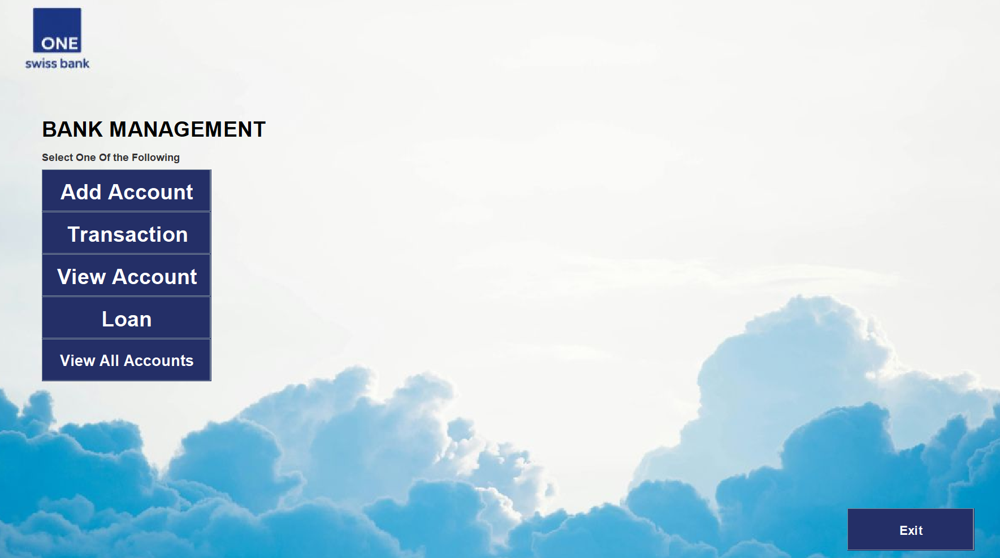

# 🏦 Bank Management System (Java Swing)

## Project Overview

The **Bank Management System** is a desktop-based Java application built using **Java Swing** to simulate fundamental banking operations. The project demonstrates **object-oriented programming**, **GUI-based interaction**, and **file-based persistence** without relying on external databases.

It is intended primarily for **academic learning**, focusing on how real-world banking workflows can be modeled using core Java concepts.

---

## Objectives

* Practice **Java Swing GUI development**
* Apply **OOP principles** 
* Implement **event-driven programming**
* Persist data using **file handling**
* Understand basic **banking workflows** in software form

---

## Key Features

* Create new bank accounts
* Manage account details through a GUI
* Perform basic banking operations (deposit, withdrawal, transfers)
* Maintain persistent account records using text files
* Simple and intuitive graphical interface
* Background image integration for improved UI aesthetics

---

## Technologies Used

* **Language:** Java  
* **GUI Framework:** Java Swing  
* **Core Concepts:**
  * Object-Oriented Programming
  * Event Handling
  * File I/O
* **IDE:** IntelliJ IDEA, NetBeans (IDE-specific files excluded via .gitignore)

---

## 📂 Project Structure

```
OPP-PROJECT-BANKING-APPLICATION
│
├── data
│   ├── Accounts.txt
│   └── filename.txt
├── img
│   ├── background_image.jpg
│   ├── background.jpg
│   ├── main_screen.png
│   └── logo.png
│
├── src
│   ├── Main.java
│   ├── Management.java
│   └── Account.java
│
├── .gitignore
└── README.md
```

### Folder Explanation

* **`src/`** – Core Java source files  
* **`img/`** – UI assets such as background and logo images  
* **`data/`** – Stores persistent application data such as account records and logs

---

## How to Run the Project

1. Ensure **Java JDK (8 or later)** is installed  
2. Open the project in **IntelliJ IDEA**  
3. Verify that image files are present inside the `img/` folder  
4. Run the application from:

   ```
   src/Main.java
   ```

5. Use the GUI menu/buttons to perform banking operations

---

## Data Storage

* All account information is stored in **`data/Accounts.txt`**
* Additional runtime data is maintained in **`data/filename.txt`**
* The file is automatically created and updated at runtime
* Data remains available across multiple executions

---

## Known Limitations

* No database integration (text-file based storage only)
* No authentication or role-based access
* Limited input validation
* Not designed for production or real banking use

---

## Possible Future Enhancements

* Integrate **MySQL / SQLite** database
* Improve exception handling and validations
* Refactor variable names for better readability
* Add user authentication (Admin / Customer roles)
* Improve GUI using layout managers (GridBagLayout, JavaFX)
* Add transaction history per account
* Encrypt stored data for security

---

## Main Screen



---

## 📌 About This Fork

This project is forked from the original repository:  
**OPP-Project-Banking-Application**  
by **Muhammad Bilawal Khan**.

### Modifications in This Fork

* Fixed GUI loading and rendering issues
* Re-structured the project directory for clarity and maintainability
* Updated and replaced background images
* Added comprehensive README documentation
